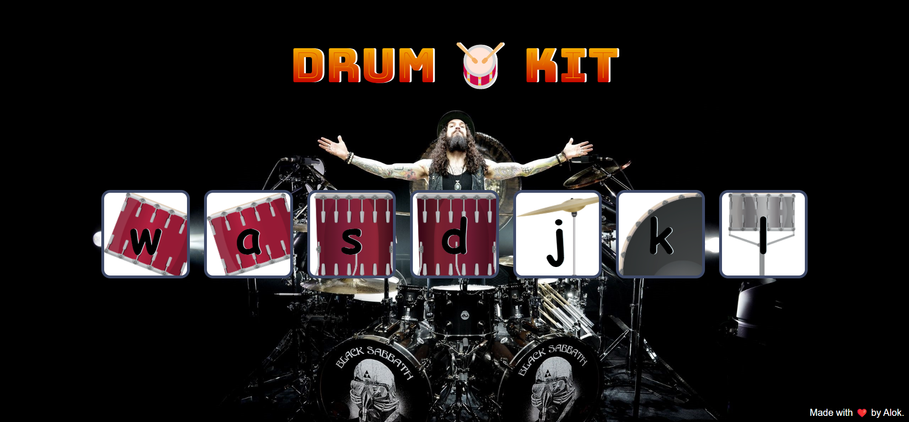

# Musical-Drum 🥁

## Introduction

The Musical Drum is a simple web application that allows users to play drum sounds by either clicking on buttons or using keyboard keys. Each button corresponds to a specific drum sound, and when activated, it plays the associated sound and provides a visual animation effect.

## Snapshot

## Demo

 - Try this [Musical Drum ](https://alokverma18.github.io/Musical-Drum/)

## Features

- Interactive interface for playing drum sounds.
- Sound effects for different Drum elements.
- Visual animation when playing sounds.
- Supports both mouse clicks and keyboard presses for sound activation.

  
## Connect 

## 
### Leave a 🌟 if it was Helpful!!
### Thanks!

